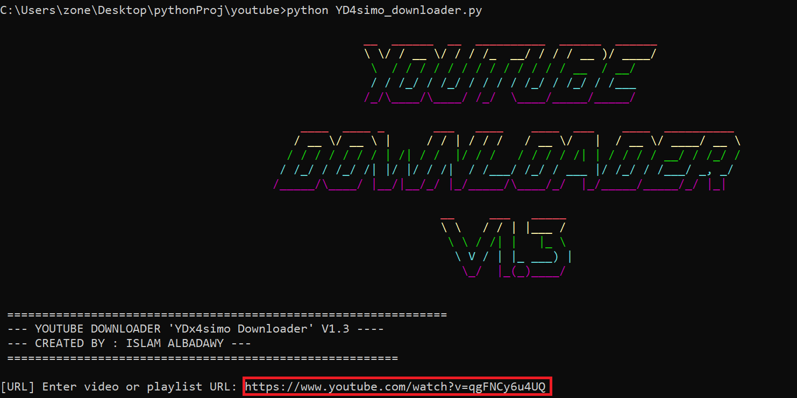
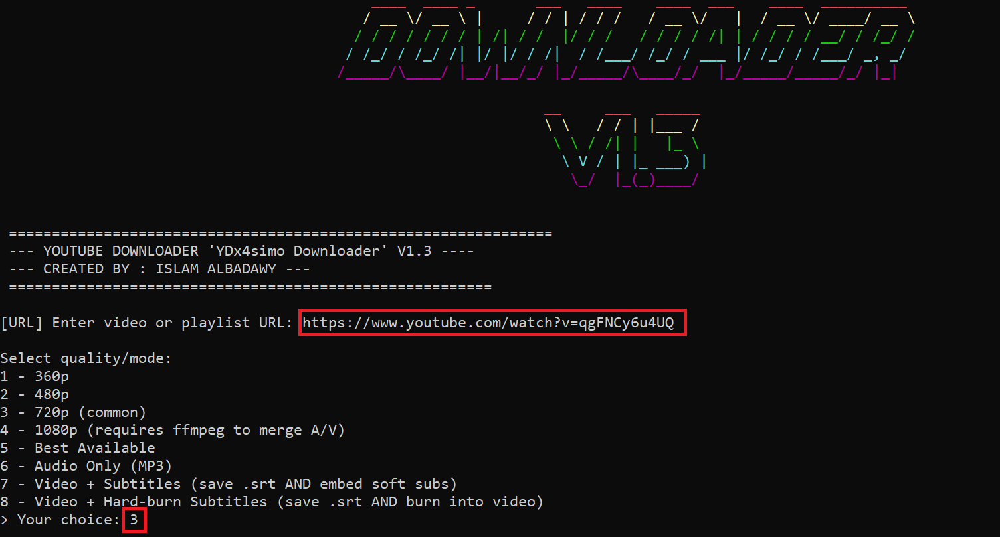
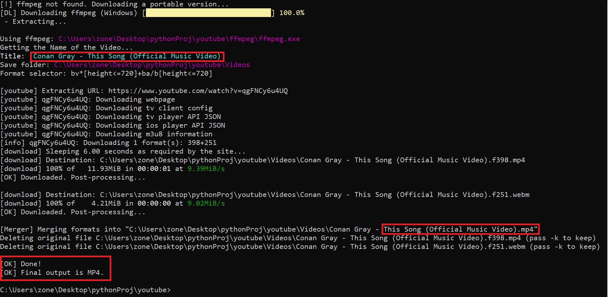
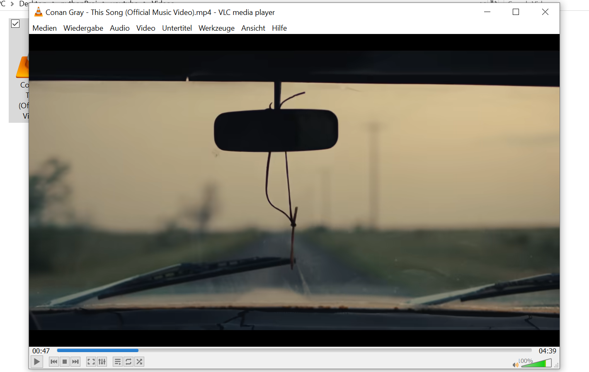

# YouTube Media Downloader CLI

A Python command-line practice project for downloading YouTube videos or playlists using `yt-dlp`.

This project was created as a learning project to improve my Python skills, especially working with command-line interfaces, external libraries, dependency handling, file management, user input and basic automation.

---

## Disclaimer

This project is for educational purposes only.
Please use it only with content you own, have permission to download, or that is publicly available for legal download. Always respect copyright rules and platform terms of service.

---

## Features

* Download YouTube videos
* Download YouTube playlists
* Select video quality such as 360p, 480p, 720p, 1080p or best available
* Save videos as MP4
* Extract audio as MP3
* Optional subtitle handling when available
* Automatic folder creation for downloaded files
* Colored command-line output
* Progress display during download
* Basic dependency setup using Python packages

---

## Skills Practiced

Through this project, I practiced:

* Python scripting
* Building command-line applications
* Handling user input
* Working with external Python packages
* File and folder management
* Basic error handling
* Using third-party tools such as `yt-dlp` and FFmpeg
* Organizing a small Python project for GitHub

---

## Technologies Used

* Python
* yt-dlp
* FFmpeg
* Colorama
* PyFiglet

---

## Installation

Clone the repository:

```bash
git clone https://github.com/IslamAbouelregal/youtube-media-downloader-python.git
cd youtube-media-downloader-python
```

Install the required packages:

```bash
pip install -r requirements.txt
```

Run the application:

```bash
python YD4simo_downloader.py
```

---

## Usage

After running the script, follow the instructions in the terminal:

```bash
python YD4simo_downloader.py
```

Downloaded files will be saved inside the `Videos` folder.

---

## Project Structure

```text
youtube-media-downloader-python/
│
├── YD4simo_downloader.py
├── requirements.txt
├── README.md
├── screenshots/
│   ├── screenshot-1.png
│   ├── screenshot-2.png
│   └── screenshot-3.png
│
└── Videos/
```

---

## Screenshots

Add your screenshots inside the `screenshots` folder and update the image paths below:






---

## What I Learned

This project helped me understand how Python can be used to build practical command-line tools.
I practiced working with external libraries, handling user choices, managing downloaded files and improving the terminal user experience.

---

## Future Improvements

* Improve the menu system
* Add better input validation
* Improve error messages
* Split the code into separate Python modules
* Add a simple graphical interface
* Add a configuration file for default settings

---

## Author

**Islam Albadawy**
Aspiring Software Developer 
